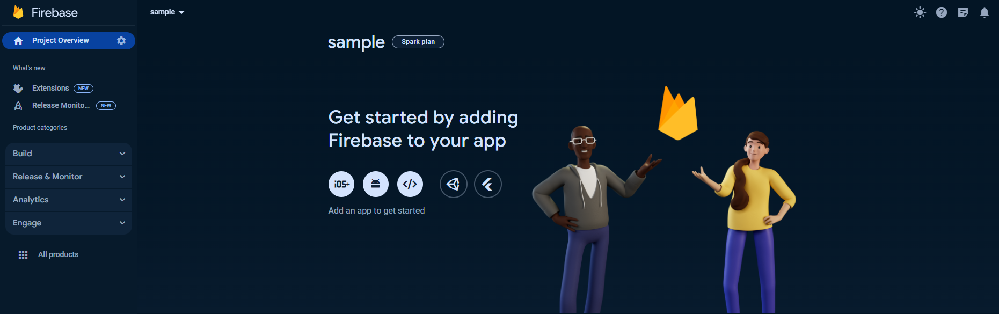
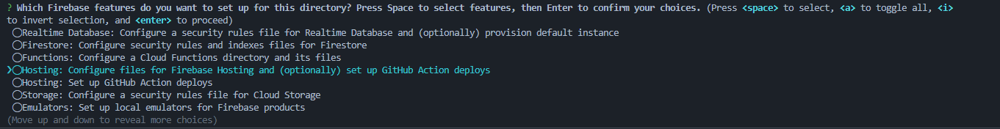
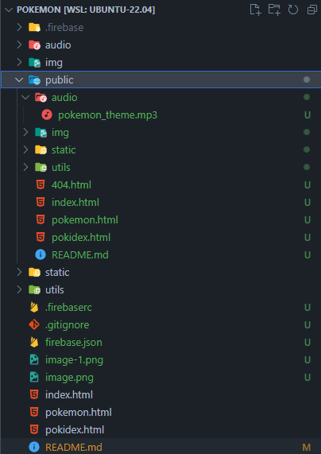

# Using Firebase as Web Host

  ### By: Raf

  - Firebase can a bit confusing especially when it is your first time to use it. Here are some quick
  ways to get started!

  ## Steps
  - Go to firebase and create a project https://firebase.google.com/.
  - Click **console* on the top right of the screen (works only if you have account).
  - Create a new project!

  ## What's next?
  - Once new project is clicked, provide a project name.
  - Press continue.
  - Choose default account.
  
  ## You will be greeted with something like this!
  

  ## Lets go further!
  - Select the icon </> for web hosting/deployment.
  - Add an app nickname.
  - Tick the checkbox.
  - click Register the App.
  - Skip **Add Firebase SDK** (unless you need libraries from firebase of course!).
  - Run this following commands:
  `npm install -g firebase-tools`
  `firebase login`
  `firebase init`
  
  - Select hosting, **Spacebar** when selecting and once selected hit **Enter**:
  

  - When prompted **What do you want to use as your public directory?** just press **Enter**.
  - You will be then prompted again of overriding of index.html, always select **No**.

  ## We are only few steps in deploying out Firebase website!
  - Test you website run command this will generate a localhost path view of the website:
  `firebase serve`
  - In the public folder delete 404.html and index, replace it with your files.
  

  - Copy the localhost path to check your website.

  ## Deployment!
  - Run command:
  `firebase deploy`

  ### Congratulations! You have just launched your first Firebase Website!
 
  ## How does it look?
  ### Landing page
  
  
  

  ### Characters Page
  
  
  
  

  ### Pokedex Page
  
  

  ## My Deployments:
  - https://raffimartin069.github.io/pokemon/
  - https://glittery-jelly-008680.netlify.app/
  - https://pokemon-ten-dusky.vercel.app/
  - https://pokemonsters-10dee.firebaseapp.com/

  ## Connect with me!:
  - https://www.linkedin.com/feed/
  - https://medium.com/@raffimartin069
  - raffimartin069@gmail.com

